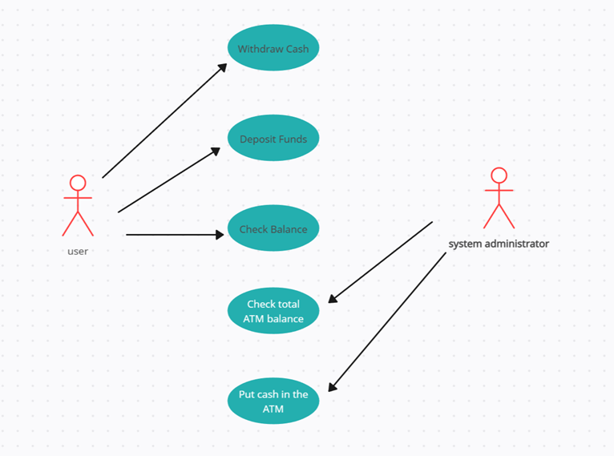

##1. `WITHDRAW_MONEY` Use Case Description: Main Flow
| **User Action**                                                          | **System Response**                                                                                    |
|--------------------------------------------------------------------------|--------------------------------------------------------------------------------------------------------|
| 1. User types in PIN into the main screen                                | 1. System checks validity of PIN and presents options to user on another screen.                       |
| 2. User selects the "Withdraw Money" option and specifies an account     | 2. System displays a prompt asking for the withdrawal amount.                                          |
| 3. User enters the desired withdrawal amount and confirms the transaction| 3. System checks account balance, verifies available funds, and dispenses the cash. Displays confirmation and updates the account balance. |

