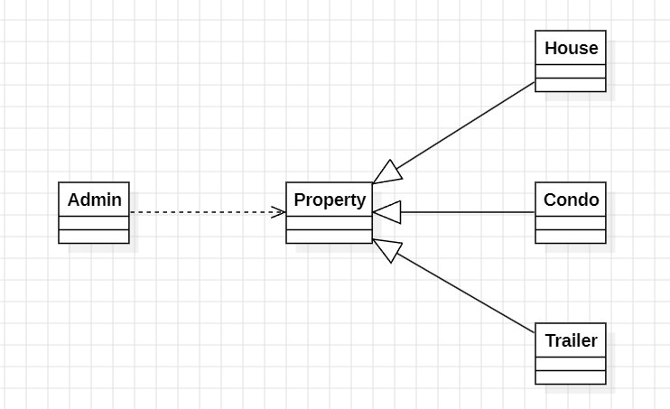

## 1.Explain why this has happened. Then provide a solution by replacing inheritance with composition.
```java
    Person p1 = new PersonWithJob("Joe", 30000);
    Person p2 = new Person("Joe");
    System.out.println("p1.equals(p2)? " + p1.equals(p2)); // false
	System.out.println("p2.equals(p1)? " + p2.equals(p1)); // true
```
- `p1.equals(p2)` is false because in the implementation of  PersonWithJob (class of p1), it has this line `if(!(aPerson instanceof PersonWithJob)) return false;` while aPerson (p2) has type Person which is NOT PersonWithJob
- `p2.equals(p1)` is true because p2 is instance of Person, and the name fields of two objects are equal
- 
## 2. [Source codes](./prob2)
## 3. [Source codes](./prob3)
Explanation of Design
The Cylinder class inherits from Circle because a cylinder extends the circle by adding the concept of height and volume.Another reason is the computeArea method in the Circle class can be reused in the Cylinder class to calculate the base area, avoiding duplication of logic.
Attributes: The radius attribute is placed in the Circle class, which is shared with the Cylinder class through inheritance, while height is specific to the Cylinder.
This design aligns better with the principle of inheritance and promotes clear and logical class hierarchies.
## 4. Properties management system
[Source codes](./prob4)
</br>

